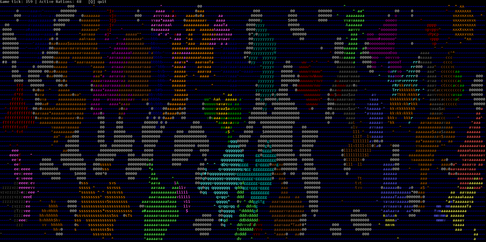

# Age of Cells

An interactive, CLI-based geopolitical world simulation engine written in Java. Age of Cells models emergent historic dynamics on a grid, including territorial expansion, economic resource gathering, and state-driven diplomacy with master-vassal hierarchies and rebellion mechanics.

<p align="center">
  
</p>

---

## Features

* **Nation Expansion & Colonization:** Nations automatically spread across procedural land tiles, expand maritime routes via naval units, and establish new territories.
* **Economic Management:** Dynamic gold accumulation based on active land, sea, and capital ownership, driving military capability and growth.
* **Diplomatic State Transitions:** Dynamic real-time transitions between peace, active war, alliances, and non-aggression pacts based on territorial density and border conflicts.
* **Master-Vassal & Hegemony Systems:**
    * Subjugate defeated nations upon capital conquest rather than complete elimination.
    * Collect recurring tribute taxes from sub-states to finance global expansion.
    * Dynamic **Liberty Desire** tracking: Vassals monitor their master's military health and launch independence wars when opportunity arises.
* **Real-time Terminal Visualization:** Custom ASCII/ANSI rendering engine for displaying borders, movement, state changes, and global history logs directly in the CLI.

---

## Project Structure

```
AgeOfCells/
├── src/
│   └── com/
│       └── aoc/
│           ├── Launcher.java
│           ├── World.java
│           ├── GameLoop.java
│           ├── cell/
│           │   ├── Cell.java
│           │   ├── CellType.java
│           │   └── TerrainType.java
│           ├── diplomacy/
│           │   └── DiplomacyManager.java
│           ├── map/
│           │   └── MapGenerator.java
│           ├── nation/
│           │   ├── Nation.java
│           │   ├── NationType.java
│           │   └── SituationState.java
│           ├── render/
│           │   └── WorldRenderer.java
│           ├── config/
│           │   └── Config.java
│           └── util/
│               ├── Color.java
│               ├── Element.java
│               ├── Screen.java
│               ├── Time.java
│               ├── Loader.java
│               └── Rng.java
├── assets/
│   └── preview.png
├── .gitignore
├── LICENSE
└── README.md

```

---

## Getting Started

### Prerequisites

* JDK 17 or higher
* Git

### Installation & Run

1. **Clone the repository:**
   ```bash
   git clone https://github.com/sma1lo/AgeOfCells.git
   cd AgeOfCells
   ```
2. **Compile the project:**
   ```bash
   javac -d bin src/com/aoc/*.java src/com/aoc/*/*.java
   ```
3. **Run the simulation:**
   ```bash
   java -cp bin com.aoc.Launcher
   ```
