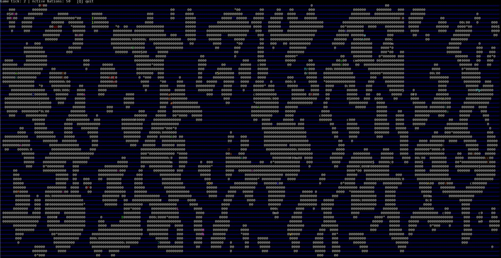

# Age of Cells

An interactive, geopolitical world simulation engine written in Java with **Lanterna**.
Age of Cells models emergent historic dynamics on a grid, including territorial expansion, economic resource gathering, and state-driven diplomacy with master-vassal hierarchies and rebellion mechanics.

<p align="center">
  
</p>

---

## Features

* **Nation Expansion:** Nations expand over land and build limited fleets (max 7 ships).
* **Resources:** Gold, Iron and Coal deposits give significant economic bonuses.
* **Diplomacy:** Peace, War and temporary Unions. Capital capture can turn nations into vassals.
* **Vassal System:** Masters collect tribute. Vassals have Liberty Desire and can rebel.
* **Economy:** Income from land, capitals, ships and resources.
* **Lanterna TUI:** Smooth terminal rendering with colors and keyboard controls.

---

## Controls

| Key | Action              |
|-----|---------------------|
| `Q` | Quit the simulation |

---

## Map Legend

| Symbol | Meaning          |
|--------|------------------|
| `A`    | Capital          |
| `a`    | Controlled land  |
| `^`    | Ship             |
| `~`    | Water            |
| `C`    | Castle           |
| `T`    | Town             |
| `v`    | Village          |
| `$`    | Gold             |
| `#`    | Iron             |
| `*`    | Coal             |
| `0`    | Unclaimed ground |

> [!NOTE]
>  Colored symbols belong to active sovereign nations. White symbols represent neutral elements.


---

## Project Structure

```
AgeOfCells/
├── src/
│   └── main/
│       ├── java/
│       │   └── com/
│       │       └── aoc/
│       │           ├── Launcher.java
│       │           ├── World.java
│       │           ├── GameLoop.java
│       │           ├── cell/
│       │           │   ├── Cell.java
│       │           │   ├── CellType.java
│       │           │   └── TerrainType.java
│       │           ├── diplomacy/
│       │           │   └── DiplomacyManager.java
│       │           ├── map/
│       │           │   └── MapGenerator.java
│       │           ├── nation/
│       │           │   ├── Nation.java
│       │           │   ├── NationGenerator.java
│       │           │   └── SituationState.java
│       │           ├── render/
│       │           │   └── WorldRenderer.java
│       │           ├── config/
│       │           │   └── Config.java
│       │           └── util/
│       │               ├── Color.java
│       │               ├── Element.java
│       │               ├── Time.java
│       │               ├── Loader.java
│       │               └── Rng.java
│       └── resources/
│           └── config.yaml
├── assets/
│   └── preview.png
├── build.gradle
├── gradlew
├── gradlew.bat
├── settings.gradle
├── .gitignore
├── LICENSE
└── README.md

```

---

## Configuration

Edit `src/main/resources/config.yaml`:

```yaml
width: 209
height: 51
smooth: 4
tickDelayMs: 50
nations: 50
```

---

## Getting Started

### Prerequisites

* JDK 17 or higher
* Git

### Installation & Run

1. **Clone the repository:**

    **Linux / macOS:**
   ```bash
   git clone https://github.com/sma1lo/AgeOfCells.git && cd AgeOfCells
   ```
    **Windows:**
   ```bash
   cd Desktop
   ```
   ```bash
   git clone https://github.com/sma1lo/AgeOfCells.git
   ```
   ```bash
   cd AgeOfCells
   ```
2. **Build the executable JAR file:** 

    **Linux / macOS:**
   ```bash
   chmod +x gradlew && ./gradlew build
   ```
   **Windows:**
   ```bash
   .\gradlew.bat build
   ```
   
3. **Run the simulation:**
   ```bash
   java -jar build/libs/AgeOfCells-1.0-SNAPSHOT.jar
   ```
